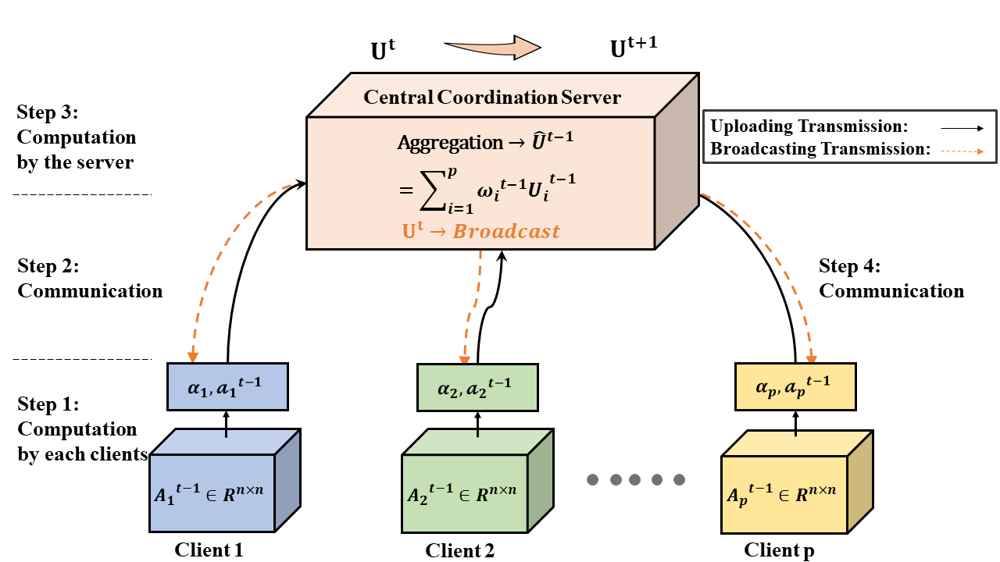

# VFedPCA+VFedAKPCA
This is the official source code for the Paper: **Vertical Federated Principal Component Analysis and Its Kernel Extension on Feature-wise Distributed Data** based on [Pytorch](https://pytorch.org/) Framework. 

> Despite enormous research interest and rapid application of federated learning (FL) to various areas, existing studies mostly focus on supervised federated learning under the horizontally partitioned local dataset setting. This paper will study the unsupervised FL under the vertically partitioned dataset setting.

## Server-Clients Architecture
<p align="center">
  
  <br>
  <b>Figure</b>: Server-Clients Architecture
</p>

## Master Branch
```
VFedPCA+VFedAKPCA                    
├── case                        // Case Studies
    ├── figs                    // Save experimental results' figures in '.eps' / '.png' format 
        ├── img_name*.eps              
        └── img_name*.png           
    ├── main.py          
    ├── model.py              
    └── utils.py                 
├── dataset                     // Put downloaded dataset in this folder
└── figs                        // Save experimental results' figures in '.eps' / '.png' format
    ├── img_name*.eps              
    └── img_name*.png           
├── README.md               
├── main.py                     // Experiment on Structured Dataset
├── model.py                   
└── utils.py                     
```

## Environments

- python = 3.8.8
- numpy = 1.20.1
- pandas = 1.2.4
- scikit-learn = 0.24.1
- scipy = 1.6.2
- imageio = 2.9.0

## Prepare Dataset
To demonstrate the superiority of our model, we utilized FIVE types of real-world datasets coming with distinct nature: 

1) structured datasets from different domains; 

2) medical image dataset; 

3) face image dataset; 

4) gait image dataset; 

5) person re-identification image dataset

**Step 1: Download Dataset from the [Google Drive URL](https://drive.google.com/drive/folders/1Rv_a02tBygvbO8FY05XxsY_lhXLiHQj6?usp=sharing)**
```bash
$ wget -c https://drive.google.com/drive/folders/1Rv_a02tBygvbO8FY05XxsY_lhXLiHQj6?usp=sharing
```

**Step 2: ** 
```bash
$ python crop_img.py --src ./dataset/DIV2K_train  --dst ./dataset/DIV2K_train_crop # as /dataset/train
$ python crop_img.py --src ./dataset/DIV2K_valid  --dst ./dataset/DIV2K_valid_crop  # as /dataset/test
```


## Training Models
```bash
python train.py -net tinynet(default)
                -path ./dataset(default)   
                [-b 32]   
                [-warm 1]   
                [-lr 0.01]  
```

## Test Models
```bash
python test.py -net tinynet(default)  
               -weight ./checkpoint/*.pth  
               -path ./demo/images   
               -result ./demo/result   
               [-b 32]  
               [-rgb]   
```
Tips
Datasets used here are relatively small, which will not take too much time for running. The actual running time of the code is determined by the number of data samples. If the datasets with a larger number of samples, the running time of VFedPCA and VFedAKPCA algorithm will be relatively long.
## Demo Results
