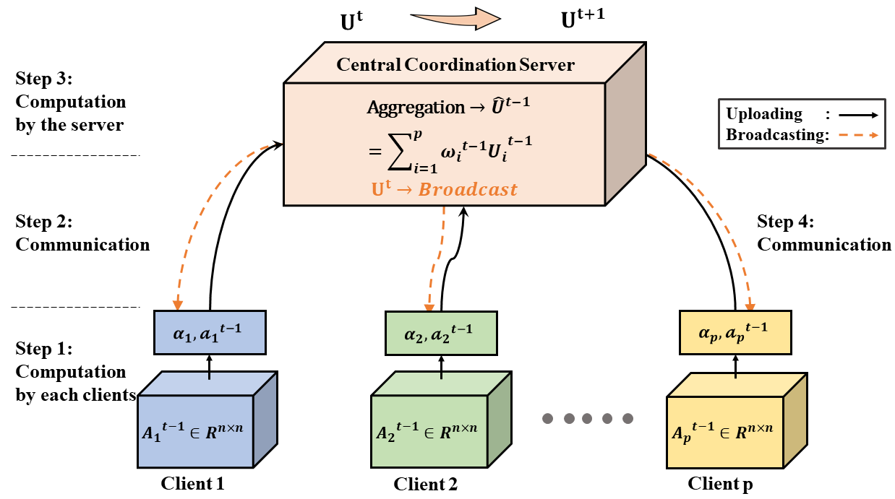
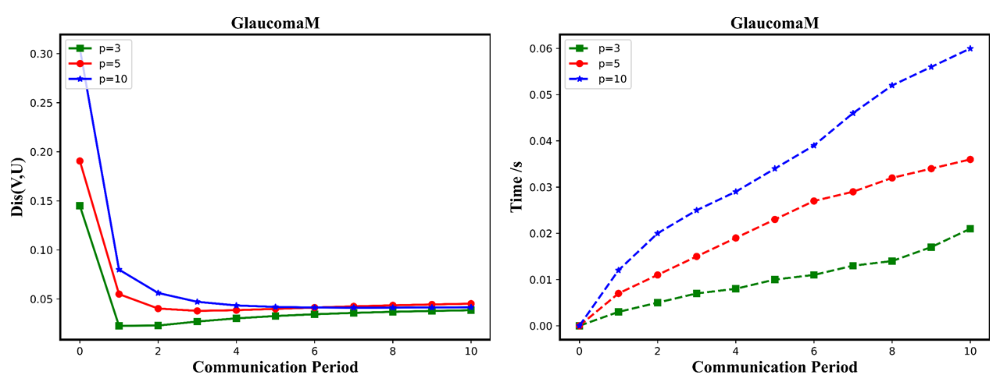
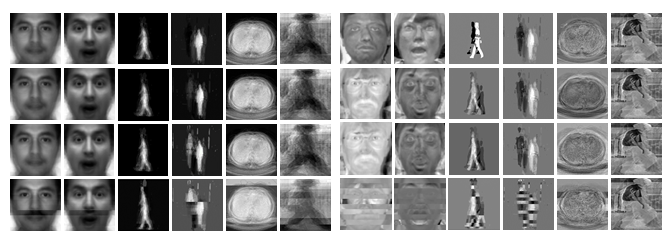
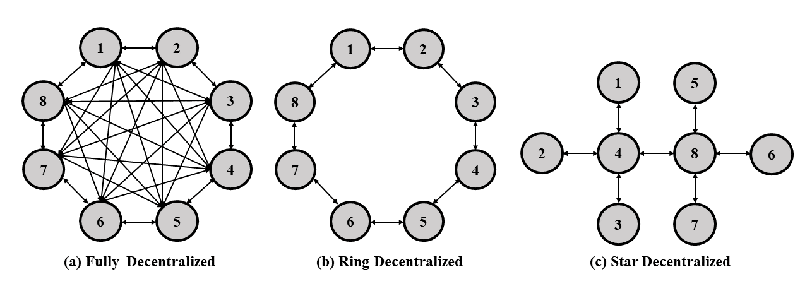
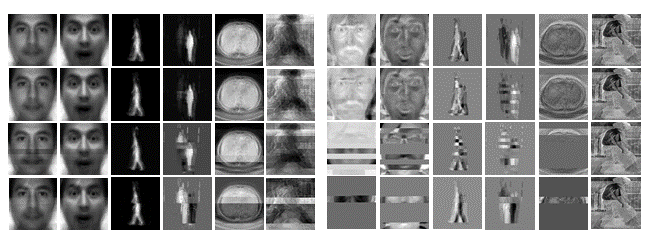

# VFedPCA+VFedAKPCA
This is the official source code for the Paper: **Vertical Federated Principal Component Analysis and Its Kernel Extension on Feature-wise Distributed Data** based on Python. 

> Despite enormous research interest and rapid application of federated learning (FL) to various areas, existing studies mostly focus on supervised federated learning under the horizontally partitioned local dataset setting. This paper will study the unsupervised FL under the vertically partitioned dataset setting.

## Server-Clients Architecture
<p align="center">
  
  <br>
  <b>Figure 1.</b>: Server-Clients Architecture
</p>

## Master Branch
```
VFedPCA+VFedAKPCA                    
└── case                        // Case Studies
    └── figs                    // Save experimental results' figures in '.eps' / '.png' format 
        ├── img_name*.eps              
        └── img_name*.png           
    ├── main.py          
    ├── model.py              
    └── utils.py                 
├── dataset                     // Put downloaded dataset in this folder
└── figs                        // Save experimental results' figures in '.eps' / '.png' format
    ├── img_name*.eps              
    └── img_name*.png           
├── README.md               
├── main.py                     // Experiment on Structured Dataset
├── model.py                   
└── utils.py                     
```

## Environments

- python = 3.8.8
- numpy = 1.20.1
- pandas = 1.2.4
- scipy = 1.6.2
- scikit-learn = 0.24.1
- imageio = 2.9.0

## Prepare Dataset
To demonstrate the superiority of our method, we utilized FIVE types of real-world datasets coming with distinct nature.  
1) structured datasets from different domains; 
2) medical image dataset; 
3) face image dataset; 
4) gait image dataset;
5) person re-identification image dataset.

**Step 1: Download Dataset from the [Google Drive URL](https://drive.google.com/drive/folders/1Rv_a02tBygvbO8FY05XxsY_lhXLiHQj6?usp=sharing)**

**Step 2: Specify Dataset Path by Command Argument** 

```bash
$ python main.py --data_path="./dataset/xxx"
```

## Experiments
We conduct extensive experiments on structured datasets to exmaines the effect of feature size, local iterations, warm-start power iterations, and weight scaling method on structed datasets. Furthermore, we investigate some case studies with image dataset to demonstrate the effectiveness of VFedPCA and VFedAKPCA.

### A. Experiment on Structured Dataset
The example is as follows. More details command usage can be check by `python main.py --help`. 

```bash
$ python main.py --data_path './dataset/College.csv' /
                 --p_list [3, 5, 10] /
                 --iter_list [10, 10, 10] /
                 --period_num 10 /
                 --sample_num 777 # use the whole by default
```

### B. Case Studies
The example is as follows. More details command usage can be check by `python main.py --help`. 

```bash
$ cd case                    # change into case folder
$ python main.py --data_path '../dataset/Image/DeepLesion' /
                 --client_num 8 / 
                 --iterations 100 / 
                 --re_size 512 /
                 --kernel sigmoid
```
# Demo Visualization
The experimental result on structured datasets (GlaucomaM), the distance error after multiple communication has been significantly reduced and converge compared with the un-communicated situation at 0-th period. 

<p align="center">
  
  <br>
  <b>Figure 2.</b> The results of VFedPCA on structured datasets (GlaucomaM).
</p>

Here is some of our case studies comparative experiment results on six image datasets: YaleFace (center-light and surprised), CasiaGait (sequence 1 and sequence 10), DeepLesion and CUHK03 (from left to right). 

<p align="center">
  
  <br>
  <b>Figure 2.</b> The results of PCA(a)/AKPCA(b) on the un-splitted data, VFedPCA(a)/VFedAKPCA(b) on the isolated data, VFedAvgPCA(a)/VFedAvgAKPCA(b) (Without Weight Scaling Method) on the isolated data, PCA(a)/AKPCA(b) on the isolated data (from top to bottom).
</p>

Furthermore, we investigate three types of decentralized topologies in Vertical Federated Learning with PCA and AKPCA (ours). The architecture of decentralized topologies are (a) Fully Decentralized, (b) Ring Decentralized, and (c) Star Decentralized, as shown in Figure 3. The experimental results are demonstrated in Figure 4. 

<p align="center">
  
  <br>
  <b>Figure 3.</b> The three different types of decentralized topology.
</p>


<p align="center">
  
  <br>
  <b>Figure 4.</b> The results of VFedPCA with the central coordination server, fully decentralized, ring decentralized, and start decentralized, from top to bottom respectively, on the isolated data from each clients. 
</p>

## Citation
```
@inproceedings{
title = {{Vertical Federated Principal Component Analysis and Its Kernel Extension on Feature-wise Distributed Data}},
author = {Yiu-ming Cheung, Fellow, IEEE, Feng Yu, and Jian Lou},
year = 2021
}
```